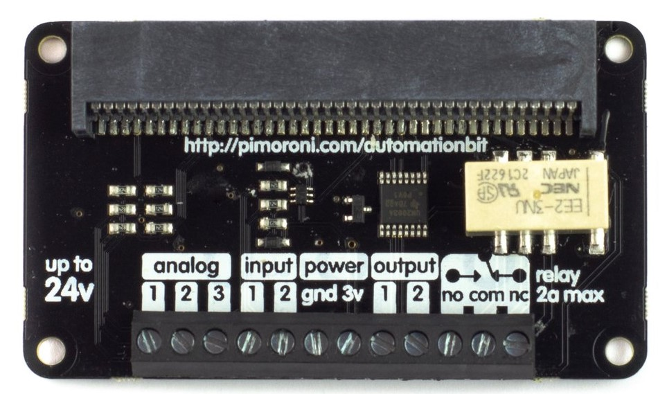
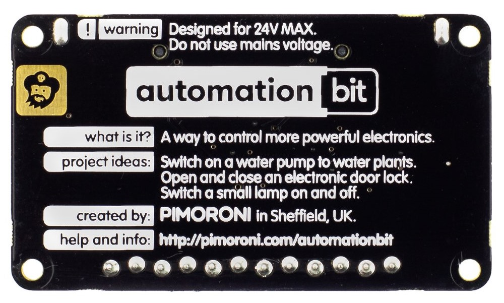

# Automationbit board test in Python

The automationbit.py test all input and output.

The board pictures
-----

The Board

<i>Front view</i>

<i>Back view</i>

Links
-----

https://github.com/pimoroni/pxt-automationbit

https://shop.pimoroni.com/products/automation-bit

