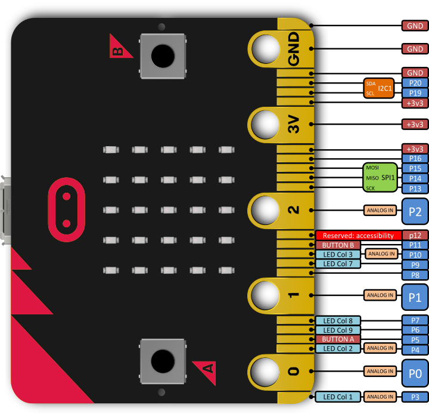

## Micro:Bit

The BBC micro:bit is the spiritual successor of the BBC Micro of the 1980s, which itself introduced a generation of children to computing. The BBC micro:bit carries on this 30 year tradition and does it 18 times faster and is 70 times smaller than its predecessor.

Based around a 32 bit ARM Cortex-M0 processor, the BBC micro:bit also features on board accelerometer and compass sensors, Bluetooth Low Energy and USB connectivity, a display consisting of 25 LEDs, two programmable buttons and it can be powered by either USB or an external battery pack. The device inputs and outputs are through five ring connectors that are part of the 21-pin edge connector.

#### Features:

- USB and Bluetooth Low energy connectivity.
- Compass and Accelerometer.
- 2 x user assignable buttons.
- A 25 LED display.
- 21 pin edge connector.

#### Contents:

- 1 x BBC micro:bit.

#### Dimensions:

- PCB Length: 52mm.
- PCB Width: 42mm.
- PCB Height: 11.7mm.

#### Board

#### Board Pinout

<i>Micro:Bit Pinout</i>

