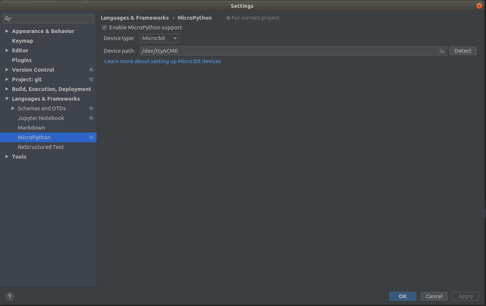
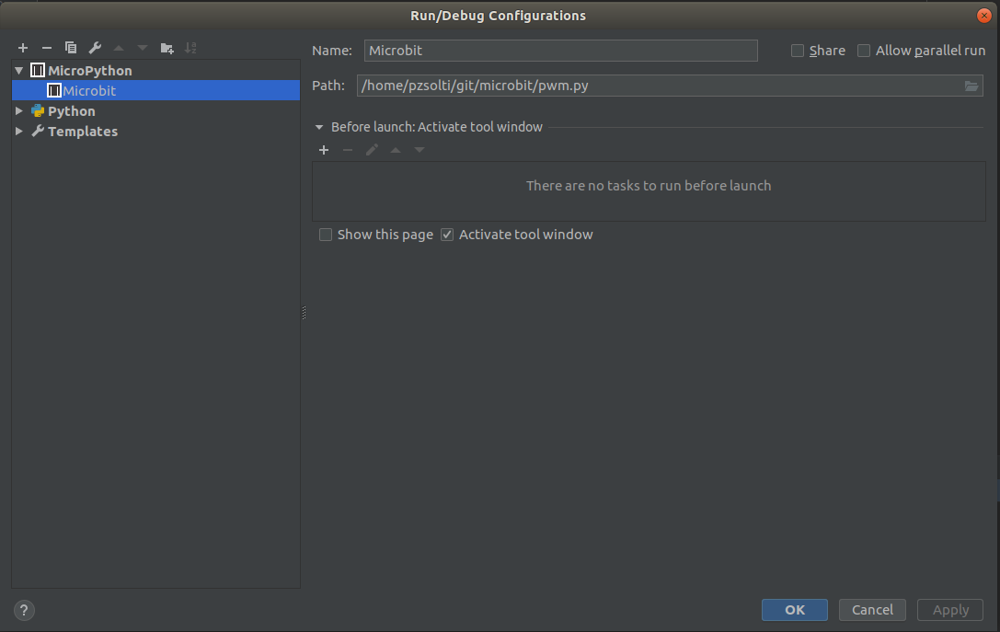
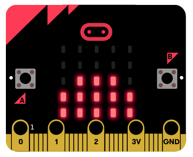

# Microbit PWM test in Python

I just want to figure out, how to work Micro:bit under Linux.
Offcorse with Python, not in web IDE.

How was it made
-----

Install MicroPython and setup under Pycharm.

<i>In Pycharm, setup MicroPython</i>

After this Run - Edit Configurations...

<i>Show only one file</i>

Usage
-----

After clone this repository. Istall Pycharm Community Edition, and setup correctly.

[Ctrl-Shift-F10] Shortcut copy the .hex file to the Micro:Bit.

Micro:Bit
-----

<i>Post-boot image</i>

https://microbit.org/

https://makecode.microbit.org/#editor

